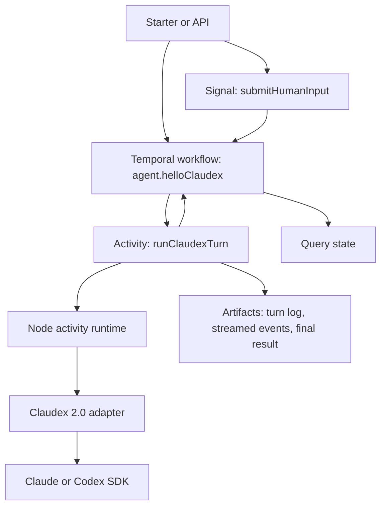

# Hello Claudex MVP

## Goal

Prove the correct integration model between Temporal and agent SDKs by building a minimal end-to-end workflow that:

- starts a Temporal workflow with an objective and working directory
- runs a bounded agent turn through Claudex
- persists normalized progress and results in workflow state
- pauses for human input between turns using Temporal signals
- resumes and completes without relying on in-memory SDK state

This MVP is about proving the Temporal boundary, not proving every agent capability.

## Why this design

Temporal workflows must stay deterministic. Claudex, Codex, and Claude sessions are stateful, side-effectful, host-local runtimes that spawn processes, read and write local files, and stream events. That makes them a bad fit for workflow-isolate code and a good fit for activities.

The core design decision is:

- workflow code owns durable orchestration state
- activity code owns agent execution
- provider session IDs are best-effort resume hints, not canonical state

## Constraints

- The current repo runs a Node 22 Temporal worker.
- `@jasonbelmonti/claudex` `2.0.x` is Node-only and ESM-only.
- Claude and Codex SDK sessions are local runtime concerns, not durable Temporal state.
- The MVP should keep the API and file layout small.

## Non-goals

- direct Claudex, Codex, or Claude SDK execution inside workflow code
- fine-grained live interception of every provider-native approval callback
- cross-host authoritative resume of provider-local sessions
- external job-runner infrastructure or async activity completion
- production-grade multi-tenant auth, quota, or billing

## MVP decision

Use a single workflow that orchestrates a sequence of bounded agent turns. Each turn is executed by one Temporal activity. The activity imports `@jasonbelmonti/claudex` directly in Node and returns a normalized result to the workflow.

This keeps the Temporal side deterministic while still letting the workflow survive worker restarts, pauses, and human approval loops.

## Proposed flow



## Temporal model

### Workflow

Workflow name:

- `agent.helloClaudex`

Responsibilities:

- hold canonical run state
- decide when to schedule the next agent turn
- decide when the workflow is waiting on human input
- expose queryable status
- accept input or approval signals
- decide when the run is complete, failed, or cancelled

The workflow does not:

- import Claudex
- read provider session files
- interpret provider-native event formats directly

### Activity

Activity name:

- `runClaudexTurn`

Responsibilities:

- validate runtime readiness
- create or resume a Claudex session
- execute one bounded agent turn
- normalize the result into a Temporal-friendly payload
- heartbeat progress while the turn is running
- return artifact refs and optional provider session hints

### Signals and queries

Signals:

- `submitHumanInput`
- `cancelRun`

Query:

- `getHelloClaudexState`

The MVP should prefer signals plus queries over updates unless we specifically need synchronous validation or acknowledgement behavior.

## Runtime boundary

Claudex 2.0 is Node-only and ESM-only, so the Node Temporal worker can import it from activity code. Workflow-isolate code still must not import Claudex, Claude SDKs, or Codex SDKs.

The runtime boundary is:

1. The workflow schedules `runClaudexTurn` with a narrow JSON-safe request.
2. The activity validates Claudex/provider readiness.
3. The activity creates or resumes a Claudex session.
4. The activity executes one bounded turn with timeout and abort handling.
5. The activity returns a JSON-safe `ClaudexTurnResponse`.

This keeps provider SDK side effects outside deterministic workflow code while removing the obsolete subprocess transport.

## Workflow contract

```ts
type HelloClaudexInput = {
  objective: string;
  provider: "claude" | "codex" | "auto";
  workingDirectory: string;
};

type HelloClaudexState = {
  workflowId: string;
  status: "running" | "waiting_for_input" | "completed" | "failed" | "cancelled";
  objective: string;
  provider: "claude" | "codex";
  turnCount: number;
  waitingReason?: string;
  latestText?: string;
  sessionRef?: {
    provider: "claude" | "codex";
    sessionId: string;
  };
  artifactRefs: ArtifactRef[];
  lastError?: string;
};
```

```ts
type RunClaudexTurnInput = {
  objective: string;
  provider: "claude" | "codex" | "auto";
  workingDirectory: string;
  priorSessionRef?: {
    provider: "claude" | "codex";
    sessionId: string;
  };
  priorSummary?: string;
  humanInput?: string;
  turnNumber: number;
};

type RunClaudexTurnResult = {
  provider: "claude" | "codex";
  outcome: "completed" | "needs_input" | "failed";
  text: string;
  sessionRef?: {
    provider: "claude" | "codex";
    sessionId: string;
  };
  artifactRefs: ArtifactRef[];
  waitingReason?: string;
  errorMessage?: string;
};
```

## Human-in-the-loop semantics

The MVP should place human input between agent turns, not inside an indefinitely blocked SDK session.

Recommended behavior:

1. The activity executes one bounded turn.
2. If the turn finishes with enough information, the workflow completes.
3. If the turn needs user input or approval, the activity returns `outcome: "needs_input"`.
4. The workflow stores the waiting reason and moves to `waiting_for_input`.
5. An external caller sends `submitHumanInput`.
6. The workflow schedules the next `runClaudexTurn` activity with that input.

This keeps waiting behavior durable and visible in Temporal instead of hidden inside an SDK-local prompt loop.

## Session and resume semantics

The workflow state is the source of truth.

The provider session reference is useful for:

- continuing a local conversation when the worker host and working directory are stable
- preserving richer provider-native context between turns

The provider session reference is not sufficient for correctness. The workflow should still carry:

- objective
- latest normalized summary
- human inputs
- artifact references
- current status

If provider session resume fails, the next activity should be able to start a fresh session using workflow-owned state.

## Workspace model

Each workflow execution should run against one explicit working directory. For the MVP, that can be the local repository or a dedicated git worktree created before the workflow starts.

Recommended default for anything mutating:

- one git worktree per workflow execution

This reduces retry ambiguity and makes file changes easier to inspect.

## Artifacts

The activity should persist artifact files under a repo-managed directory such as:

- `var/hello-claudex/<workflowId>/turn-<n>-events.json`
- `var/hello-claudex/<workflowId>/turn-<n>-result.json`

Artifact refs stored in workflow state should include:

- `artifactId`
- `kind`
- `path`
- `createdAt`

The workflow query should expose artifact refs so an API or CLI can inspect the run later.

## Retries and cancellation

Recommended MVP posture:

- heartbeat during long-running agent turns
- map Temporal activity cancellation to process abort
- avoid aggressive automatic retries for mutating turns
- allow retries for readiness or startup failures

If a turn edits files or runs commands, retries must be conservative because the underlying side effects are not guaranteed to be idempotent.

## Testing strategy

The MVP needs two layers of verification.

### Offline smoke

Use an injected in-process fake Claudex adapter so we can verify:

- compiled Temporal workflow bundle still runs
- workflow state transitions are correct
- signal-driven resume works
- artifact refs are stored correctly

This should run in normal local and CI flows.

### Live smoke

Add an opt-in authenticated smoke test that requires local Claude or Codex auth. This test proves:

- Claudex readiness checks work
- one real agent turn completes against a real provider

This should be explicitly gated and not required for normal CI.

## Minimal file plan

- `src/claudex-turn/turn-contract.ts`
- `src/claudex-turn/turn-codec.ts`
- `src/claudex-turn/run-claudex-turn.ts`
- `src/claudex-turn/claudex-runtime.ts`
- `src/claudex-turn/turn-mapping.ts`
- `src/claudex-turn/runner-controls.ts`
- `src/workflows/hello-claudex-contract.ts`
- `src/workflows/hello-claudex.ts`
- `src/activities/run-claudex-turn.ts`
- `src/activities/index.ts`
- `src/client/start-hello-claudex.ts`
- `src/testing/claudex-turn-runner.test.ts`
- `src/testing/hello-claudex-bundle-smoke.test.ts`
- `README.md`

## MVP proof criteria

The approach is proven if all of the following are true:

- a workflow can start with an objective and working directory
- the workflow can execute at least one real or fake bounded agent turn through the activity boundary
- the workflow can pause for human input and resume on a signal
- the workflow query exposes durable state independent of provider-local memory
- the compiled Temporal bundle has automated smoke coverage
- the design can recover from losing provider session state by falling back to workflow-owned summary and inputs

## Deferred work

- async activity completion backed by an external sandbox runner
- child workflows for multi-agent decomposition
- richer approval handling mapped from provider-native callbacks
- provider-neutral artifact ingestion using `@jasonbelmonti/claudex/ingest`
- API endpoints for start, inspect, and signal operations
